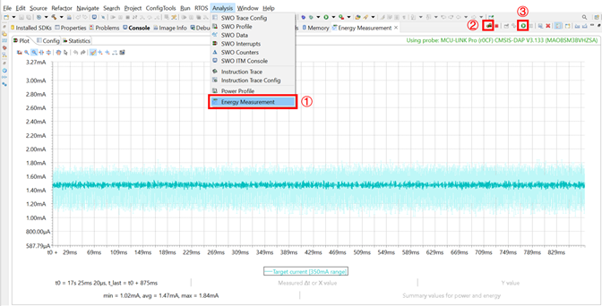

# NXP Application Code Hub

## low power measurement on mcxn236
The low power measurement demo is used to reproduce the power consumption and wake-up time in the datasheet on the FRDM-MCXN236 board.

#### Boards: FRDM-MCXN236
#### Categories: Low Power
#### Peripherals: CLOCKS, UART
#### Toolchains: IAR

## Table of Contents
1. [Software](#step1)
2. [Hardware](#step2)
3. [Setup](#step3)
4. [Results](#step4)
5. [FAQs](#step5) 
6. [Support](#step6)
7. [Release Notes](#step7)

## 1. Software
- [IAR 9.50.1](https://www.iar.com/)
- [SDK_2.14.0_FRDM-MCXN236](https://mcuxpresso.nxp.com/en/welcome)

## 2. Hardware
- FRDM-MCXN236 Rev C board.

- One Type-C USB cable.

> If you want to measure wake-up time, prepare an oscilloscope or logic analyzer.

> If you want to measure power consumption, prepare an [MCU-Link Pro](https://www.nxp.com/design/design-center/software/development-software/mcuxpresso-software-and-tools-/mcu-link-pro-debug-probe:MCU-LINK-PRO) or multimeter.

## 3. Setup

### 3.1 Hardware setup and connection
- Remove R71, solder header at JP2 and use jumper to connect.
- Use a Type-C USB cable to connect J10 of FRDM-MCXN236 and the USB port of the PC.

### 3.2 Configure and Download Project
- The default configuration for this project is WAKEUP_EN=0, which is used to reproduce the power consumption data in the datasheet. If you want to reproduce the wake-up time in the datasheet, need to update it to WAKEUP_EN=1.

- Make and Download the project to FRDM-MCXN236, then reset the MCU. 

### 3.3 Select power mode
- Open a serial terminal with 57600 baud rate.
- Follow the prompts and input number to enter different power mode.

- After inputting the case number, the symbol and registers value will be printed.

### 3.4 Measure power consumption
- Use an multimeter to measure the current at JP2 of the FRDM-MCXN236 board.

- Use MCU-Link Pro and MCUXpresso IDE to measure power consumption:
  - Configure the MCU-Link Pro current measurement range from 350mA to 50mA by changing the 3 jumpers J16/J17/J18 to short pins 2-3.
  - Connect MCU-Link Pro board to FRDM-MCXN236 board.

  |MCU-Link Pro|FRDM-MCXN236|
  |--|--|
  |J9-1|JP2-2|
  |J9-3|JP2-1|
  |J9-2|J3-14|

  - Follow below steps to measure current with MCUXpresso IDE.

### 3.5 Measure wake-up time
- Get the wake-up time by measuring the delay between the falling edges of J8-13 (P0_20) and J8-28 (P3_11) using an oscilloscope.
  - You need to press SW2(WAKEUP button) to wake up the MCU. 

## 4. Results
The following power consumption and wake-up time are provided as a reference:

> Different samples, temperature and measuring instrument etc. will affect test results.

> Before measuring each data, POR is required.

> If you want to measure power consumption of IDD_CM_OD_1, please porting **CoreMark** to     this project.

> The wake-up time of Deep Power Down needs to be configured as 144MHz boot, and all other measurement data uses the default 48MHz boot.

> If you want to measure the wake-up time of other configurations, please refer to table 228.         LPWKUP_DELAY configuration in Reference Manual to configure LPWKUP_DELAY.

> “Table 18. Power mode transition operating behaviors” in datasheet lists wake-up time, “3.2.6   Power consumption operating behaviors” in datasheet lists different power consumption data.

|Symbol|Power consumption in datasheet|Tested Power consumption|Wake-up time in datasheet|Tested wake-up time|
|--|--|--|--|--|
|IDD_ACT_OD_1|7.43mA|7.68mA|N/A|N/A|
|IDD_CM_OD_1|8.93mA|8.76mA|N/A|N/A|
|IDD_SLEEP|1.48mA|1.45mA|0.22us|0.22us|
|IDD_DSLEEP_LP|0.12mA|0.12mA|8.7us|8.6us|
|IDD_PDOWN_LP|1.75uA|1.95uA|9.8us|9.7us|
|IDD_PDOWN_RET_0V7|2.52uA|2.89uA|N/A|N/A|
|IDD_DPOWN_32K|1.28uA|1.55uA|5.6ms|5.6ms|

## 5. FAQs
*Include FAQs here if appropriate. If there are none, then state "No FAQs have been identified for this project".*

## 6. Support
*Provide URLs for help here.*

#### Project Metadata
<!----- Boards ----->

<!----- Categories ----->

<!----- Peripherals ----->
 

<!----- Toolchains ----->

Questions regarding the content/correctness of this example can be entered as Issues within this GitHub repository.

>**Warning**: For more general technical questions regarding NXP Microcontrollers and the difference in expected funcionality, enter your questions on the [NXP Community Forum](https://community.nxp.com/)

## 7. Release Notes
| Version | Description / Update                           | Date                        |
|:-------:|------------------------------------------------|----------------------------:|
| 1.0     | Initial release on Application Code Hub        | May 21th 2024 |

